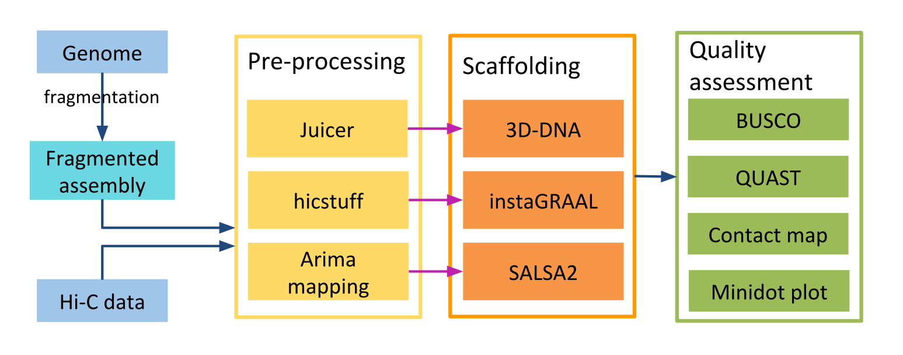

# Benchmarking Hi-C scaffolders

This repository provides command lines and additional information for the poster "Benchmarking Hi-C scaffolders", presented at JOBIM 2019.

This work evaluates three Hi-C scaffolders, 3D-DNA, instaGRAAL and SALSA2, on the genomes of _Caenorhabditis elegans_ and _Drosophila melanogaster_.

Data used for _C. elegans_ comes from:
- Genome: BioProject PRJNA13758 https://www.ncbi.nlm.nih.gov/assembly/GCF_000002985.6
- Hi-C data: SRR3105481

Data used for _D. melanogaster_ comes from:
- Genome: BioProject PRJNA380132 https://www.ncbi.nlm.nih.gov/assembly/GCA_002300595.1
- Hi-C data: SRR5579171

## Overview of the benchmark

The command lines and script to generate the simulated fragmented genomes are in simulation/.
The command lines to run the scaffolders are in scaffolding/.
The command lines for quality assessment and additional data are in quality_assessment.
