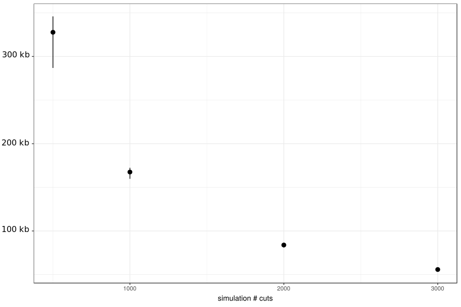
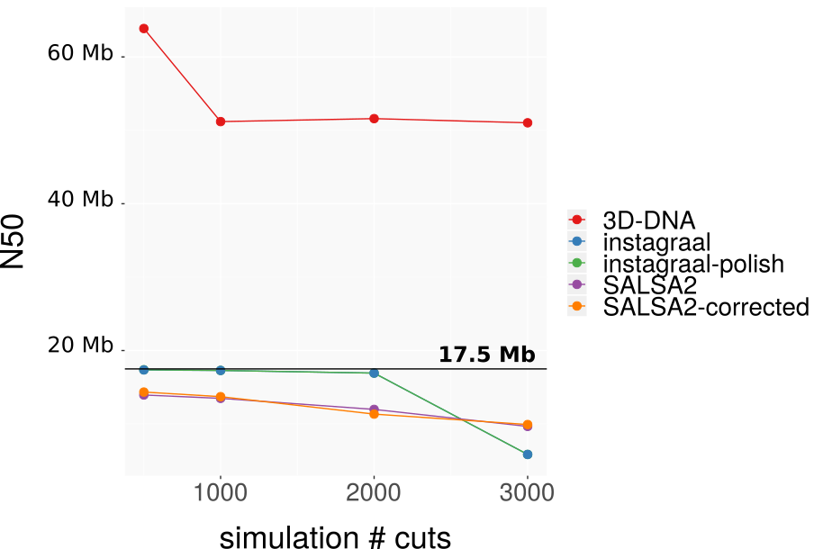
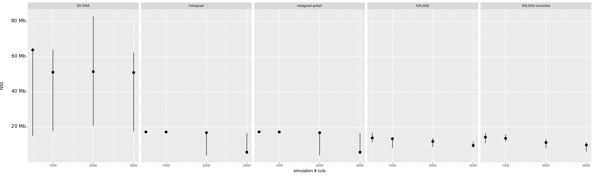
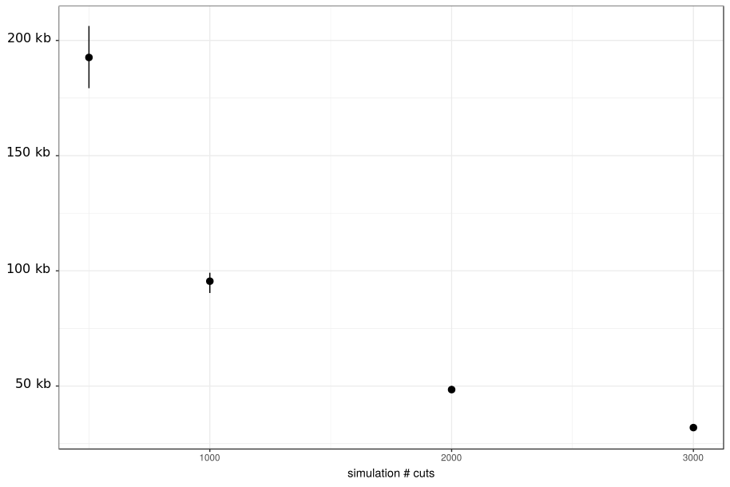
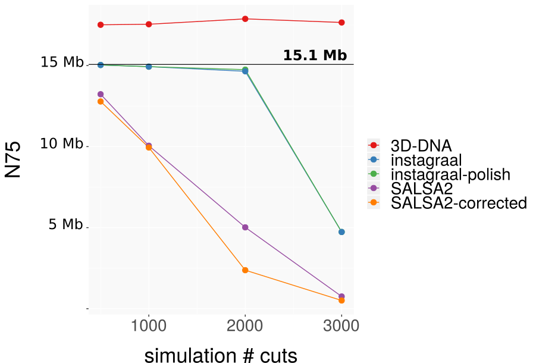
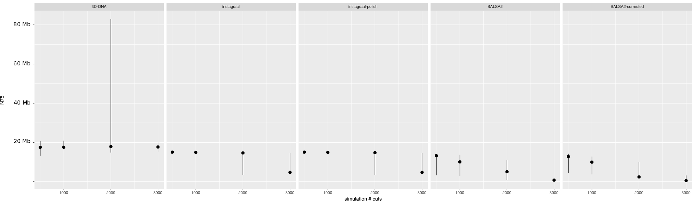
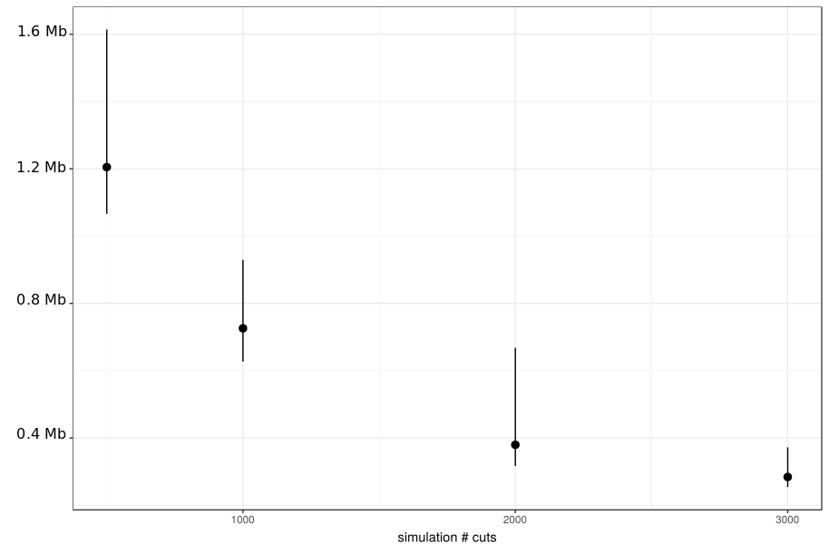
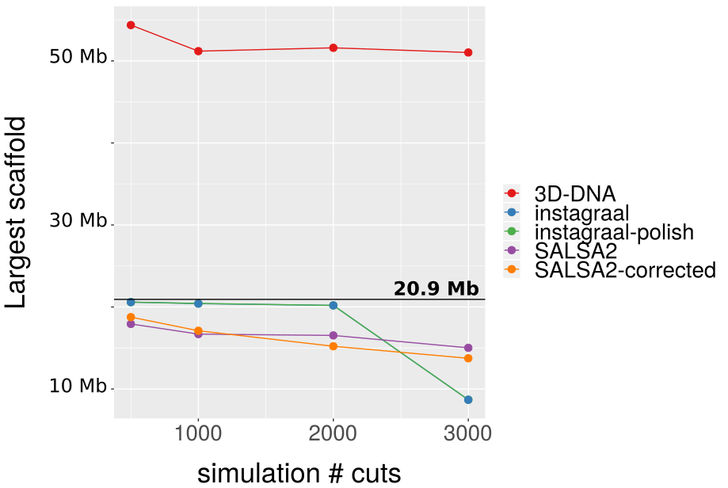
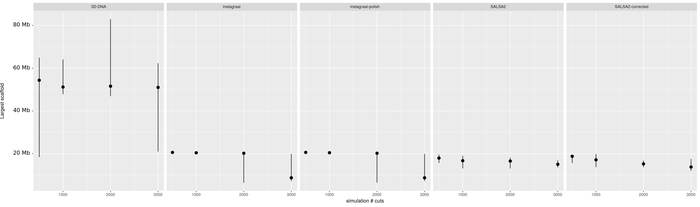

# Evaluation of N50, N75 and largest scaffold

3D-DNA obtained higher values of N50, N75 and largest scaffold size than expected (N50 over 50 Mb when the expected N50 is 17.5 Mb). These huge values are due to a fusion of scaffolds. The principle of 3D-DNA is to build a megascaffold then break it according to discrepancies in interactions, and it seems that in this case the splitting step was not successful. The result is still satisfying, because the user can detect the limits of chromosomes using the contact map and manually adjust the scaffolds. Besides, the efficiency did not decrease with the highest fragmentation tested (3000 cuts), as opposed to instaGRAAL and SALSA2. There are however huge variations depending on the replicate.

instaGRAAL has the best values of N50, N75 and largest scaffold size up to 1000 cuts, with almost no variation among the replicates. At 2000 and 3000 cuts, instaGRAAL is more sensitive: it obtained values close to the reference for some replicates, but other replicates did not perform well. instaGRAAL appears as a reliable tool when the expected number of chromosomes is not known.

SALSA2 showed the lowest N50, N75 and largest contig size, with a moderate decrease over time. There is a moderate variation of performances depending on the replicates. It is to be noted however that SALSA2 is the easiest scaffolder to run: for C. elegans, it was used on a laptop, while 3D-DNA and instaGRAAL require more resources.

## N50 

 
 
**Figure 1. Median, minimum and maximum N50 of simulated fragmented genomes over number of cuts.** 
 
 

 
 
**Figure 2. Median N50 over number of cuts in fragmented genome.** 
 
 

 
**Figure 3. Median, minimum and maximum N50 over number of cuts in fragmented genome.** 
 
 

## N75

 
**Figure 4. Median, minimum and maximum N75 of simulated fragmented genomes over number of cuts.** 
 
 

 
**Figure 5. Median N75 over number of cuts in fragmented genome.** 
 
 

 
**Figure 6. Median, minimum and maximum N75 over number of cuts in fragmented genome.** 
 
 

# Largest scaffold

 
**Figure 7. Median, minimum and maximum largest scaffold size of simulated fragmented genomes over number of cuts.** 
 
 

 
**Figure 8. Median largest scaffold size over number of cuts in fragmented genome.** 
 
 

 
**Figure 9. Median, minimum and maximum largest scaffold size over number of cuts in fragmented genome.** 
 
 
