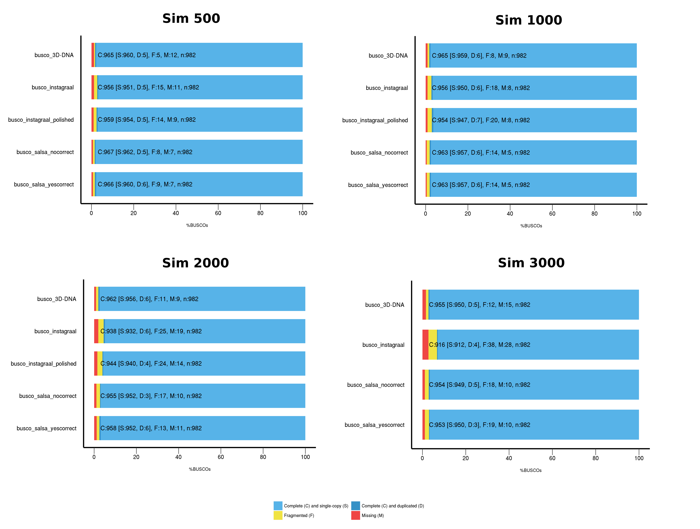
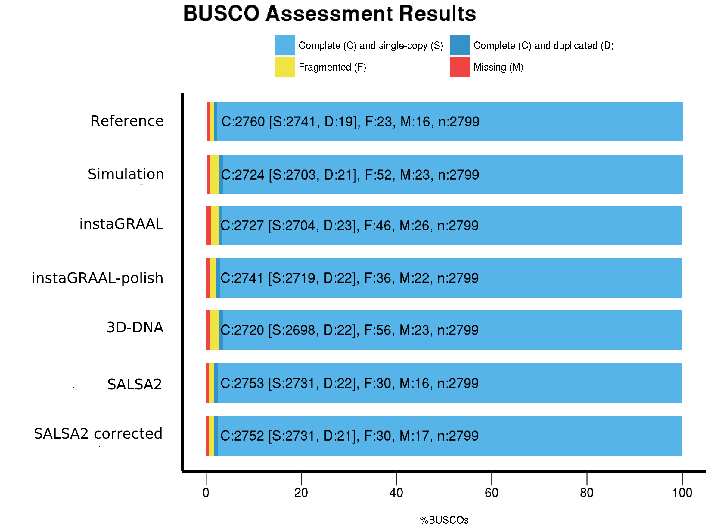
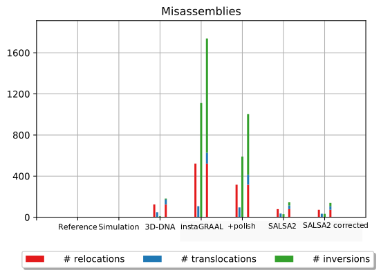

The quality of the scaffolds was evaluated with BUSCO and Quast, compared to the reference genome.

# BUSCO

BUSCO is available at https://busco.ezlab.org/

The lineages that were given as input to BUSCO were:
- nematoda_odb9 for C. elegans
- diptera_odb9 for D. melanogaster

The parameters used to run BUSCO are: <br/>
&nbsp;&nbsp;&nbsp;&nbsp;&nbsp;&nbsp;-i : input sequence <br/>
&nbsp;&nbsp;&nbsp;&nbsp;&nbsp;&nbsp;-l : lineage retrieved from the BUSCO website <br/>
&nbsp;&nbsp;&nbsp;&nbsp;&nbsp;&nbsp;-m : mode, "genome" for genome assemblies <br/>
&nbsp;&nbsp;&nbsp;&nbsp;&nbsp;&nbsp;--long : optimization mode <br/>


```bash
busco -i celegans_scaffolding.fa -o celegans_busco_output -l nematoda_odb9 -m genome --long
busco -i dmelanogaster_scaffolding.fa -o dmelanogaster_busco_output -l diptera_odb9 -m genome --long
```

These commands were run for all the scaffoldings, the simulations and the reference genomes. Plots can then be generated by moving all the files containing "short_summary" in a folder, here called BUSCO_reports, and then using the command generate_plot.py. The only argument to give is -wd, which is the folder described previously.


```bash
generate_plot.py -wd BUSCO_reports
```

## Caenorhabditis elegans


<br/>
**Figure 1. BUSCO assessment of C. elegans scaffoldings.** Although several replicates were run in the case of C. elegans, only the results for one replicate are displayed.<br/>
<br/>
<br/>

## Drosophila melanogaster


<br/>
**Figure 2. BUSCO assessment of D.melanogaster scaffoldings.** Simulation # cuts = 2000.<br/>
<br/>
<br/>

# QUAST

QUAST is available here http://quast.sourceforge.net/quast

QUAST was run with the reference genome and the reference genome's features.

The arguments are: 
&nbsp;&nbsp;&nbsp;&nbsp;&nbsp;&nbsp;-R : reference genome
&nbsp;&nbsp;&nbsp;&nbsp;&nbsp;&nbsp;--eukaryote : cause... well... it's an eukaryote
&nbsp;&nbsp;&nbsp;&nbsp;&nbsp;&nbsp;--features : genome features
&nbsp;&nbsp;&nbsp;&nbsp;&nbsp;&nbsp;--min-identity : minimum alignment identity
&nbsp;&nbsp;&nbsp;&nbsp;&nbsp;&nbsp;--labels : names to attribute to columns
&nbsp;&nbsp;&nbsp;&nbsp;&nbsp;&nbsp;--k-mer-stats : k-mer-based quality metrics 
&nbsp;&nbsp;&nbsp;&nbsp;&nbsp;&nbsp; list of assemblies to assess


```bash
quast.py -R reference.fa --eukaryote --features reference_features.gff -o sim_c500_quast --min-identity 99.9 \
    --labels "3D-DNA, instaGRAAL, instaGRAAL-with-polish, SALSA2-with-correct, SALSA2-without-correct" sim_c500/scaffolding* --k-mer-stats
```


<br/>
**Figure 3. Detection of misassemblies in D. melanogaster scaffolds.** Simulation # cuts = 2000.<br/>
<br/>
<br/>
