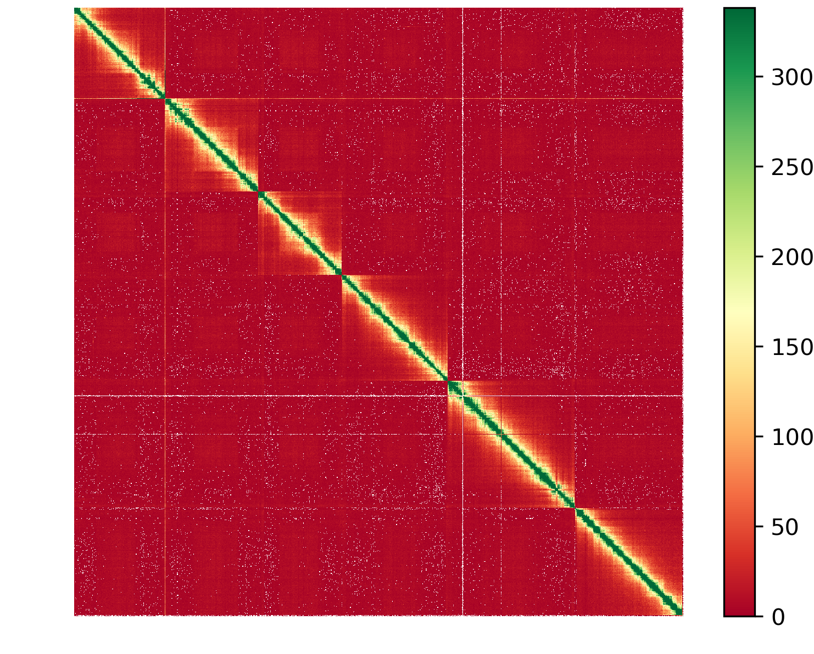
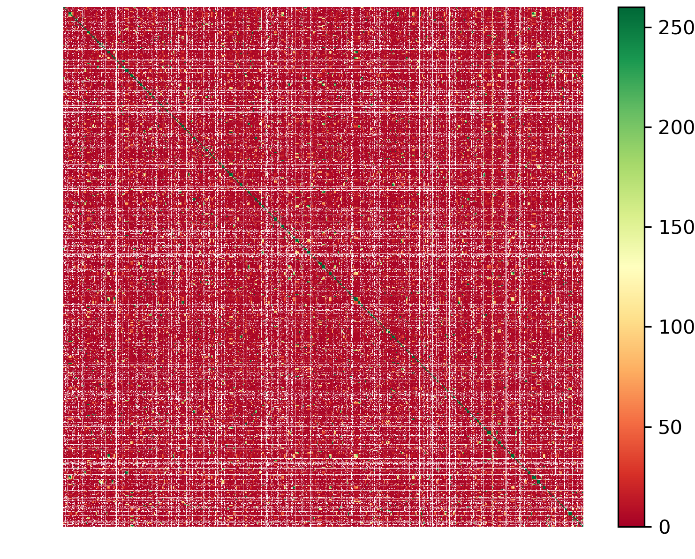

The reference genome of Caenorhabditis elegans WBcel235 was retrieved from the NCBI database. This is a complete assembly, with 7 contigs : chr I, II, III, IV, V, X and mitochondrial.<br/>

chr I&nbsp;&nbsp;&nbsp;&nbsp;&nbsp;&nbsp;NC_003279.8&nbsp;&nbsp;&nbsp;&nbsp;&nbsp;&nbsp;15072434<br/>
chr II&nbsp;&nbsp;&nbsp;&nbsp;&nbsp;&nbsp;NC_003280.10&nbsp;&nbsp;&nbsp;&nbsp;&nbsp;&nbsp;15279421<br/>
chr III&nbsp;&nbsp;&nbsp;&nbsp;&nbsp;&nbsp;NC_003281.10&nbsp;&nbsp;&nbsp;&nbsp;&nbsp;&nbsp;13783801<br/>
chr IV&nbsp;&nbsp;&nbsp;&nbsp;&nbsp;&nbsp;NC_003282.8&nbsp;&nbsp;&nbsp;&nbsp;&nbsp;&nbsp;17493829<br/>
chr V&nbsp;&nbsp;&nbsp;&nbsp;&nbsp;&nbsp;NC_003283.11&nbsp;&nbsp;&nbsp;&nbsp;&nbsp;&nbsp;20924180<br/>
chr X&nbsp;&nbsp;&nbsp;&nbsp;&nbsp;&nbsp;NC_003284.9&nbsp;&nbsp;&nbsp;&nbsp;&nbsp;&nbsp;17718942<br/>
MT&nbsp;&nbsp;&nbsp;&nbsp;&nbsp;&nbsp;NC_001328.1&nbsp;&nbsp;&nbsp;&nbsp;&nbsp;&nbsp;13794<br/>

# Testing Hi-C data

Hi-C data were downloaded from public databases. The quality of the dataset was tested by mapping the Hi-C reads against the reference genome and building the contact map using the tool **hicstuff**. It is available here: https://github.com/koszullab/hicstuff<br/>

The full pipeline can be run with a single command line :


```bash
hicstuff pipeline --enzyme DpnII \
    --genome GCF_000002985.6_WBcel235_genomic.fna \
    --filter --iterative \
    -o hicstuff \
    end1.fastq end2.fastq
```

Here the parameters indicate: <br/>
&nbsp;&nbsp;&nbsp;&nbsp;&nbsp;&nbsp;--enzyme : the enzyme used to prepare the Hi-C library<br/>
&nbsp;&nbsp;&nbsp;&nbsp;&nbsp;&nbsp;--genome : the reference genome to map the reads against<br/>
&nbsp;&nbsp;&nbsp;&nbsp;&nbsp;&nbsp;--filter : to filter the reads<br/>
&nbsp;&nbsp;&nbsp;&nbsp;&nbsp;&nbsp;--iterative : to do an iterative mapping<br/>

Then the contact map is built with the files generated by the pipeline :


```bash
hicstuff view --binning=100kb \
    --frags=hicstuff/fragments_list.txt \
    --normalize hicstuff/abs_fragments_contacts_weighted.txt \
    --cmap=RdYlGn
```

The contact map represents the interaction frequencies in the whole genome. Six "squares" of heightened interaction frequencies are distinguisable: these are the six nuclear chromosomes. Intrachromosomal interactions are more frequent than interchromosomal interactions. The contact map can be used to evaluate the quality of an assembly.



# Simulation of a fragmented assembly with different number of cuts

The script fragment_genome.py makes a number of cuts, given as parameter -c, in the input genome. The simulated fragmented genome will then be used to test the scaffolders.<br/>

Different number of cuts are tested, to generate more/less fragmented assemblies: 500, 1000, 2000.<br/>

Here, the command makes 500 cuts in the reference genome :<br/>


```bash
python3 fragment_genome.py --cut 500 --out sim_c500/sim_c500__GCF_000002985.6_WBcel235_genomic.fa
```

The output file used for scaffolding is called sim_c500_GCF_000002985.6_WBcel235_genomic.mixed.fa, where the fragments are organized in a random order.<br/>

The statistics for the fragmented assemblies are as follow :<br/>

## cut = 500

stats for sim_c500/sim_c500_GCF_000002985.6_WBcel235_genomic.mixed.fa<br/>
sum = 100286401, n = 507, ave = 197803.55, largest = 1066561<br/>
N50 = 325954, n = 99<br/>
N60 = 272956, n = 132<br/>
N70 = 213945, n = 173<br/>
N80 = 162591, n = 226<br/>
N90 = 107197, n = 301<br/>
N100 = 69, n = 507<br/>
N_count = 0<br/>
Gaps = 0<br/>

## cut = 1000

stats for sim_c1000/sim_c1000_GCF_000002985.6_WBcel235_genomic.mixed.fa<br/>
sum = 100286401, n = 1007, ave = 99589.28, largest = 647248<br/>
N50 = 170184, n = 183<br/>
N60 = 137901, n = 249<br/>
N70 = 105640, n = 331<br/>
N80 = 80096, n = 440<br/>
N90 = 55310, n = 588<br/>
N100 = 156, n = 1007<br/>
N_count = 0<br/>
Gaps = 0<br/>

## cut = 2000

stats for sim_c2000/sim_c2000_GCF_000002985.6_WBcel235_genomic.mixed.fa<br/>
sum = 100286401, n = 2007, ave = 49968.31, largest = 391496<br/>
N50 = 81968, n = 383<br/>
N60 = 69145, n = 516<br/>
N70 = 54307, n = 681<br/>
N80 = 41159, n = 893<br/>
N90 = 26857, n = 1192<br/>
N100 = 73, n = 2007<br/>
N_count = 0<br/>
Gaps = 0<br/>


# Building a contact map with the fragmented genome

After simulating the fragmented assembly, the Hi-C reads can be mapped against it to build the contact map. The contact map should now look "disorganised".<br/>

The previous steps to build the contact map with the reference genome are repeated with the fragmented assembly:<br/>


```bash
hicstuff pipeline --enzyme DpnII \
    --genome GCF_000002985.6_WBcel235_genomic.fna \
    --filter --iterative \
    -o hicstuff \
    end1.fastq end2.fastq
    
hicstuff view --binning=100kb \
    --frags=hicstuff/fragments_list.txt \
    -c RdYlGn -o hicstuff \
    hicstuff/abs_fragments_contacts_weighted.txt
```


